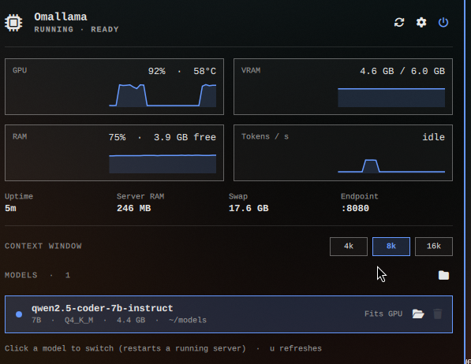

# Omallama

Run and monitor a local [llama.cpp](https://github.com/ggml-org/llama.cpp) server from the [Omarchy](https://omarchy.org) bar.



Click the chip icon in the bar to open a panel where you can start and stop the server, watch the GPU, memory and tokens per second, and manage your local GGUF models. Stopping the server when you are not coding gives the VRAM and RAM straight back.

## Quick start

Omallama controls a local `llama-server`, so it needs two things that are not part of the plugin: **llama.cpp** and **a model**. You do those once. The panel's setup screen does the rest (the background service) and walks you through each step.

**1. Install the plugin and put it on the bar**

```bash
omarchy plugin add https://github.com/dexterhere/omallama.git --enable
omarchy bar put dexterhere.omallama
```

Plugins run unsandboxed, so read the code first. See [Install](#install).

**2. Install llama.cpp** (skip this if you already have `llama-server`; it is found in your `PATH`, `~/.local/bin`, `~/llama.cpp/build/bin`, `~/Work/llama.cpp/build/bin`, `/usr/local/bin` and a few other places)

NVIDIA:

```bash
sudo pacman -S --needed cuda cmake git && export NVCC_CCBIN=${NVCC_CCBIN:-/usr/bin/g++-15} PATH=$PATH:/opt/cuda/bin && git clone --depth 1 https://github.com/ggml-org/llama.cpp ~/llama.cpp && cd ~/llama.cpp && cmake -B build -DGGML_CUDA=ON -DCMAKE_CUDA_ARCHITECTURES=native -DCMAKE_BUILD_TYPE=Release && cmake --build build -j4 --target llama-server
```

AMD, Intel or integrated graphics (Vulkan):

```bash
sudo pacman -S --needed vulkan-headers vulkan-icd-loader shaderc cmake git && git clone --depth 1 https://github.com/ggml-org/llama.cpp ~/llama.cpp && cd ~/llama.cpp && cmake -B build -DGGML_VULKAN=ON -DCMAKE_BUILD_TYPE=Release && cmake --build build -j4 --target llama-server
```

No GPU (CPU only):

```bash
sudo pacman -S --needed cmake git && git clone --depth 1 https://github.com/ggml-org/llama.cpp ~/llama.cpp && cd ~/llama.cpp && cmake -B build -DCMAKE_BUILD_TYPE=Release && cmake --build build -j4 --target llama-server
```

**3. Get a model.** Any `.gguf` works. Qwen2.5-Coder 7B (4.4 GB) suits a 6 GB GPU; the setup screen suggests a size that fits your memory:

```bash
mkdir -p ~/models && curl -L -C - -o ~/models/qwen2.5-coder-7b-instruct-q4_k_m.gguf https://huggingface.co/Qwen/Qwen2.5-Coder-7B-Instruct-GGUF/resolve/main/qwen2.5-coder-7b-instruct-q4_k_m.gguf
```

Or add a file you already have from the panel with the folder icon.

**4. Open the panel.** Click the chip icon in the bar. The setup screen checks each step and shows what is missing. Click **Install service**, then the power button to start the server. It listens on `http://localhost:8080/v1`.

## Features

- **Start, stop and restart** the server from the bar. Middle-click the icon to toggle it without opening the panel.
- **Live graphs** for GPU load and temperature, VRAM (or shared memory on integrated graphics), RAM and tokens per second.
- **Model manager**: finds every `.gguf` on the machine, shows size, quantization and whether it fits your hardware, switches the active model, shows it in your file manager, and deletes it after a confirmation.
- **Add a model** with a normal file chooser. The file's GGUF header is verified before it is added.
- **Search**: the list shows three models at a time, with a search box when you have more.
- **Settings**: context window, GPU or CPU offload, compact KV cache, port, extra `llama-server` arguments, stop-when-idle, start at login, and a one-click Zed config.
- **First-run onboarding** that checks llama.cpp, your graphics, the service and your models, and fixes what it can.
- **Hardware aware**: NVIDIA, AMD (discrete and APU), Intel (Arc and integrated) or no GPU at all.

## Requirements

- Omarchy with the Quickshell-based shell.
- A `llama-server` binary from llama.cpp. If you do not have one, the onboarding copies the right build command for your GPU.
- `systemd` user services, `curl`, `bash`.

For GPU stats on NVIDIA you need the driver utilities (`nvidia-smi`, package `nvidia-utils`). AMD and Intel stats are read from `/sys`, so nothing extra is needed.

Optional, and the onboarding tells you which are missing:

| Tool (Arch package) | Used for |
| --- | --- |
| `wl-clipboard` | copy and paste buttons |
| `libnotify` | the "stopped after idle" notice |
| `python-gobject` (or `zenity` / `kdialog`) | the file chooser |
| `xdg-utils`, `nautilus` | opening folders and showing a model in the file manager (Nautilus selects the file; other managers just open the folder) |
| `pciutils` | the GPU name |
| `journalctl` (systemd), Omarchy's `omarchy-launch-tui` | the "View logs" button |

## Install

```bash
omarchy plugin add https://github.com/dexterhere/omallama.git --enable
```

Plugins run unsandboxed inside `omarchy-shell`. Read the code before enabling it. Omallama can start a local server and delete model files you confirm.

Then put the widget on your bar:

```bash
omarchy bar put dexterhere.omallama
```

## First run

Open the panel. If anything is missing you land on the setup screen:

| Step | What it checks | If it is red |
| --- | --- | --- |
| llama.cpp server | a `llama-server` binary on this machine | **Copy build command** for your GPU |
| Graphics | your GPU and whether your build can use it | **Copy rebuild command** |
| Background service | the `omallama` systemd user service | **Install service** |
| A model | at least one `.gguf`, and an active one | **Add from files**, or **Copy download** for a size that fits your memory |
| Helper tools | clipboard, notifications, file chooser | **Copy install command** |

The service file and its settings are generated for you in `~/.config/systemd/user/omallama.service` and `~/.config/omallama/env`. Omallama only writes its own files, and only when you click **Install service** or **Reinstall service**. If you edited the service file by hand, the previous copy is saved as `omallama.service.bak` before it is replaced. It also creates an empty `~/models` folder if you have none.

## Building llama.cpp

The onboarding copies one of these for you (Arch package names):

| Hardware | Backend | Build |
| --- | --- | --- |
| NVIDIA | CUDA | `cmake -B build -DGGML_CUDA=ON -DCMAKE_CUDA_ARCHITECTURES=native` |
| AMD, Intel, integrated | Vulkan | `cmake -B build -DGGML_VULKAN=ON` |
| No GPU | CPU | `cmake -B build` |

Each is followed by `cmake --build build -j4 --target llama-server`. On other distributions install the same toolchain with your package manager.

## Integrated graphics

An integrated GPU has no memory of its own, so Omallama shows **shared memory** (how much system RAM the server holds) instead of VRAM, and judges whether a model fits against about half of your RAM. Intel GPUs expose no unprivileged utilization counter, so the GPU card shows `n/a` for load. A Vulkan build of llama.cpp is needed to use an integrated GPU; otherwise models run on the CPU.

## Models

Omallama looks for `.gguf` files in `~/models`, the Hugging Face and LM Studio caches, Downloads, Documents, `/opt`, `/srv`, `/mnt`, `/run/media`, a shallow sweep of your home folder, and anything you add yourself. Vision projector files and non-first shards of split models are skipped.

Deleting removes the real file from disk after you confirm in the panel. The active model cannot be deleted.

## Use it from Zed

Settings → Tools → **Copy Zed config** copies a ready-made `language_models` snippet for the active model. Paste it into Zed's `settings.json` and add any API key in Zed's agent settings. The server speaks the OpenAI API at `http://localhost:8080/v1`.

## Commands

```bash
omarchy-shell dexterhere.omallama toggle         # open or close the panel
omarchy-shell dexterhere.omallama toggleServer   # start or stop llama-server
omarchy-shell dexterhere.omallama restartServer
omarchy-shell dexterhere.omallama rescan         # rescan for models
omarchy-shell dexterhere.omallama browse         # open the file chooser
omarchy-shell dexterhere.omallama setup          # show or hide the setup screen
```

## Files

| Path | Purpose |
| --- | --- |
| `Panel.qml` | bar icon and panel |
| `Model.js` | parsing and formatting, covered by `tests/run.js` |
| `sample.sh` | one sample of GPU, memory and server state |
| `doctor.sh`, `setup.sh` | environment check, service installer and remover |
| `setmodel.sh` | writes settings and the added-models list |
| `scan.sh` | finds models on the machine |
| `browse.sh`, `pick.py` | file chooser for adding models |
| `lib.sh` | binary lookup and GPU detection |

## Uninstall

Removing a plugin cannot run cleanup code, so stop the service first:

1. Open the panel, then Settings → Tools → **Uninstall service**. It stops the server and deletes the `omallama` systemd user service. Your models and settings are kept.
2. Remove the plugin:

```bash
omarchy plugin remove dexterhere.omallama
```

Everything Omallama created lives in two places. To erase all of it, including your saved settings and added-models list (your model files are never touched):

```bash
systemctl --user disable --now omallama
rm -f ~/.config/systemd/user/omallama.service
rm -rf ~/.config/omallama
systemctl --user daemon-reload
```

## Development

```bash
npm test
```

runs the model tests, the GPU detection tests (fake sysfs trees for Intel, AMD, NVIDIA and no GPU), hostile-path tests for the scanner and settings, and the service removal test. The AMD and Intel paths are tested that way; they have not been run on that hardware yet. Reports from real machines are welcome.

After editing QML, `omarchy restart shell` makes the change show reliably.

## License

MIT
